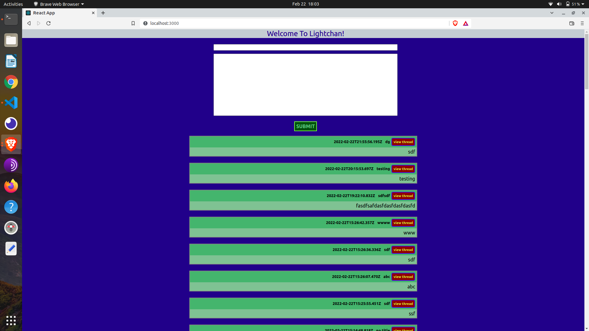
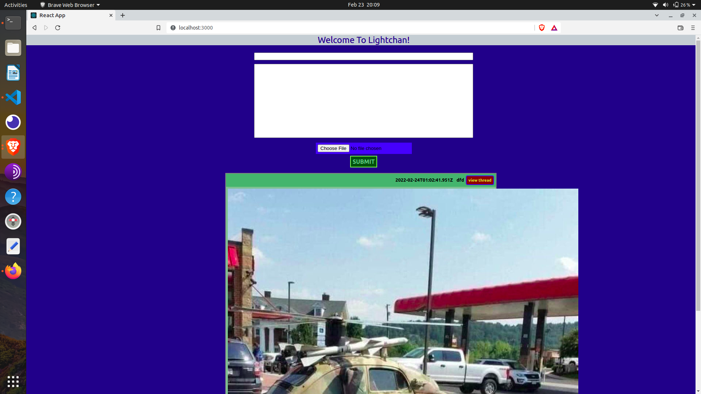
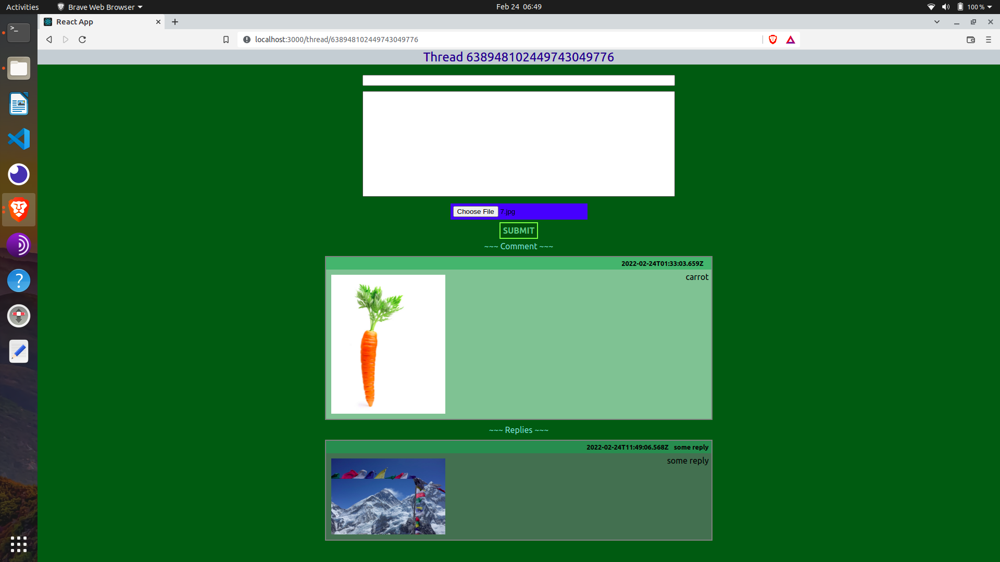

# Lightchan Project

This is a new piece of image board software that I am starting to work on. It's just starting and I'm making the project public as I work. If anyone wants to help or contribute send me a message and I'll invite you to the repo. 

## Why New Image Board Software

The current host of image board software either uses outdated software, is firmly established (4chan), or is no longer in active development. Other social media websites are not made on an anonymous basis and rely on logged in users. It's my belief that it's possible to make a new image board using more recent software (in this case React and Python) in a way that will be appealing.

## The Path Forward

After creating basic functionality the site will go live with a single board. User input will be asked for on a rolling basis to improve the functionality of the site.

## License

Anyone can clone and use the project so long as you don't sell the software for money. Thanks!

### Current Functionality

Here is a front page with comments.

A thread can be replied to.

Can now add and display images for comments (formatting forthcoming)

Pic handling formmatted and replies now work